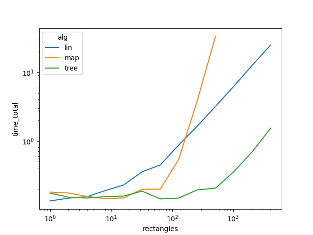

# Лабораторная работа 2

### Цели работы
**Реализовать три алгоритма для решения задачи по поиску 
количества прямоугольников принадлежащих точке**

---
## Алгоритм перебора
Алгоритм не требует подготовки, дополнительная обработка данных 
не предусмотрена.

Для каждой точки перебирает прямоугольники и проверяет, 
лежит ли точка в границах прямоугольника.

Работает за линейное время, зависящее от числа прямоугольников.
```python
def algorithm(n, m):
    rec_file = open("../data/rectangles.txt", "r")
    mas_rectangle = [[int(x) for x in rec_file.readline().split()] for _ in range(n)]

    rec_file = open("../data/points.txt", "r")
    for _ in range(m):
        counter = 0
        point_x, point_y = [int(x) for x in rec_file.readline().split()]
        for rec in mas_rectangle:
            if rec[0] <= point_x < rec[2] and rec[1] <= point_y < rec[3]:
                counter += 1
        print(counter, end=" ")
```
---
## Алгоритм на карте
### Подготовка
В качестве подготовки к алгоритму нужно первым делом сжать координаты
прямоугольников по каждой оси. 
Для этого создается два массива `points_x` и `points_y`
в которых лежат координаты `Х` и `У` без повторов соответственно.
```python
mas_rectangle = []
    points_x, points_y = set(), set()
    rec_file = open("../data/rectangles.txt", "r")
    for _ in range(n):
        points = [int(x) for x in rec_file.readline().split()]

        points_x.add(points[0])
        points_x.add(points[2])
        points_y.add(points[1])
        points_y.add(points[3])

        mas_rectangle.append(points)

    points_x, points_y = list(points_x), list(points_y)
    points_x.sort()
    points_y.sort()
```
На выходе мы получили два массива, 
в которых сжатой координате точки, 
по которой задается прямоугольник, 
соответствует индекс `Х` и `У` этой точки 
в каждом из массивов соответственно.

Следующий шаг - построение карты, в которой каждой точке 
соответствует число прямоугольников, входящих в нее.
Размерность карты составляет количество уникальных `Х` минус 1 
на количество уникальных `У` минус 1.
Максимальный размер карты `map[2n - 1][2n - 1]`.

При построении карты для каждого прямоугольника находим индексы в
массивах `points_x` и `points_y` и в полученных границах увеличиваем
значения на 1.

```python
c_map = [[0] * (len(points_x) - 1) for _ in range(len(points_y) - 1)]

    for rec in mas_rectangle:
        compressed_x1 = points_x.index(rec[0])
        compressed_y1 = points_y.index(rec[1])
        compressed_x2 = points_x.index(rec[2])
        compressed_y2 = points_y.index(rec[3])

        for x in range(compressed_x1, compressed_x2):
            for y in range(compressed_y1, compressed_y2):
                c_map[len(points_y) - 2 - y][x] += 1
```

Алгоритм подготовки работает за `О(n ** 3)`

---
### Поиск ответа
Для того, чтобы найти ответ для заданной точки, 
нужно сжать ее координаты, найти ее положение на карте и вывести 
значение, которое там лежит по этим координатам.

Для сжатия координат используется бинарный поиск.
```python
def bin_search(mass, target):
    if target < mass[0] or target >= mass[-1]:
        return -1
    left, right = 0, len(mass)
    while right - left > 1:
        mid = (right + left) // 2
        if mass[mid] > target:
            right = mid
        else:
            left = mid
    return left
```

Как только мы сжали координаты и убедились, что точка находится 
в пределах нашей области, можно выводить ответ.
```python
def algorithm(m, c_map, points_x, points_y):
    rec_file = open("../data/points.txt", "r")
    for _ in range(m):
        x, y = [int(x) for x in rec_file.readline().split()]

        compressed_x = bin_search(points_x, x)
        compressed_y = bin_search(points_y, y)

        if compressed_x == -1 or compressed_y == -1:
            print(0, end=" ")
        else:
            print(c_map[len(points_y) - 2 - compressed_y][compressed_x], end=" ")
```
Поиск ответа работает за `О(logn)`

---
## Алгоритм на дереве
Для реализации этого алгоритма требуется персистентное 
дерево отрезков, которое так же будет работать со сжатыми 
координатами.
Столбцу на карте соответствует одно дерево, для каждого 
следующего столбца строится новая версия дерева.
На выходе получим, что индексы внутри дерева отрезков - 
это сжатая координата по одной оси, а номер версии дерева 
соответствует сжатой координате по другой оси.


Узел дерева, включает в себя значение,
границы отрезка, за который он отвечает (правая граница не включена)
и ссылки на детей
```python
class Node:
    def __init__(self, left=None, right=None):
        self.left_border, self.right_border = left, right
        self.left_child, self.right_child = None, None
        self.value = 0
```

Рекурсивная функция создает дерево отрезков
```python
def create_tree(left, right):
    node = Node(left, right)
    if left + 1 < right:
        mid = (right + left) // 2
        node.left_child = create_tree(left, mid)
        node.right_child = create_tree(mid, right)
    return node
```

Для создания новых версий дерева требуется реализация функций, 
которые будут копировать узел дерева.


Функция используется для копирования узла дерева без копирования детей
```python
def copy_without_children(node):
    new_node = Node(node.left_border, node.right_border)
    new_node.value = node.value
    return new_node
```

Функция используется для копирования узла дерева с изменением 
значения и с сохранением ссылок на старых детей
```python
def copy_of_node(node, v):
    new_node = Node(node.left_border, node.right_border)
    new_node.value = node.value + v
    new_node.left_child = node.left_child
    new_node.right_child = node.right_child
    return new_node
```

Функция используется для создания новой версии дерева
```python
def change_tree(node, left, right, value):
    if left <= node.left_border and node.right_border <= right:
        return copy_of_node(node, value)
    if right <= node.left_border or node.right_border <= left:
        return node
    new_node = copy_without_children(node)
    new_node.left_child = change_tree(node.left_child, left, right, value)
    new_node.right_child = change_tree(node.right_child, left, right, value)
    return new_node
```
---
### Подготовка

Aлгоритм строит массивы неповторяющихся координат `Х` и `У` для прямоугольников
на основе этих массивов будет происходить сжатие координат для точек
после этого создается дерево отрезков по принципу:
создается новая версия дерева для каждого `У` являющегося границей прямоугольника,
в эту версию дерева сохраняются изменения по оси `Х` (создается 
массив изменений по оси `Х`, в котором указывается координата `У`, 
начальная и конечная координата `Х` и тип изменения: `1` - начало 
прямоугольника, `-1` - конец)

Далее строится персистентное дерево отрезков по этим изменениям.
```python
def preprocessing(n):
    if n:
        rec_file = open("../data/rectangles.txt", "r")
        mas_x_changes = []
        points_x, points_y = set(), set()
        for _ in range(n):
            points = [int(x) for x in rec_file.readline().split()]

            points_x.add(points[0])
            points_x.add(points[2])
            points_y.add(points[1])
            points_y.add(points[3])

            mas_x_changes.append([points[1], points[0], points[2], 1])
            mas_x_changes.append([points[3], points[0], points[2], -1])

        points_x, points_y = list(points_x), list(points_y)
        points_x.sort()
        points_y.sort()
        mas_x_changes = sorted(mas_x_changes, key=lambda x: x[0])

        tree = create_tree(0, len(points_x) - 1)
        persistent_trees = [tree]
        new_tree = None

        pref, ind = mas_x_changes[0][0], 0
        while ind <= len(mas_x_changes) - 1:
            if mas_x_changes[ind][0] != pref:
                persistent_trees.append(new_tree)
                pref = mas_x_changes[ind][0]

            while ind != len(mas_x_changes) and pref == mas_x_changes[ind][0]:
                new_tree = change_tree(persistent_trees[-1] if not new_tree else new_tree,
                                       points_x.index(mas_x_changes[ind][1]), points_x.index(mas_x_changes[ind][2]),
                                       mas_x_changes[ind][3])
                ind += 1

        persistent_trees.append(tree)
        return persistent_trees, points_x, points_y
    return False, False, False
```

Подготовка - `O(nlogn)`

---
### Поиск ответа
У каждой точки сжимаются координаты по такому же принципу, 
как и в алгоритме на карте. По сжатой координате `У` 
выбираем нужную версию дерева и проходимся по ней в поисках ответа.

Функция проходится по дереву и считает количество прямоугольников, 
в которые входит точка.
```python
def find(node, target):
    if not node.right_child and not node.left_child:
        return node.value
    mid = (node.right_border + node.left_border) // 2
    if target < mid:
        return node.value + find(node.left_child, target)
    return node.value + find(node.right_child, target)
```

Поиск ответа
```python
def algorithm(m, persistent_trees, points_x, points_y):
    rec_file = open("../data/points.txt", "r")
    if persistent_trees is not False:
        for _ in range(m):
            x, y = [int(x) for x in rec_file.readline().split()]

            compressed_x = bin_search(points_x, x)
            compressed_y = bin_search(points_y, y)

            if compressed_x == -1 or compressed_y == -1:
                print(0, end=" ")
            else:
                print(find(persistent_trees[compressed_y + 1], compressed_x), end=" ")
    else:
        for _ in range(m):
            x, y = [int(x) for x in input().split()]

            print(0, end=" ")
```

Поиск ответа - `O(logn)`

---

## Тестирование

Для каждого алгоритма проводилось тестирование - 
замер времени подготовки и ответа.
Количество прямоугольников - от `1` до `2 ** 12`, количество точек - `100000`.

Для большей точности каждое тестирование проводилось 10 раз и 
вычислялось среднее значение по времени.

Функция генерирует тестовый набор прямоугольников вложенных 
друг-в-друга с координатами с шагом больше 1.
```python
def create_rectangles(number):
    rec_file = open("../data/rectangles.txt", "w")
    for i in range(number):
        rec_file.write(str(10 * i) + " " + str(10 * i) + " " + str(10 * (2 * number - i)) +
                       " " + str(10 * (2 * number - i)) + "\n")
```

Функция генерирует неслучайный набор точек
распределенных более-менее равномерно по ненулевому пересечению 
прямоугольников
```python
def create_points(number):
    points_file = open("../data/points.txt", "w")
    for i in range(number):
        points_file.write(str(pow(1009 * i, 31) % (20 * number)) + " " + str(pow(1013 * i, 31) % (20 * number)) + "\n")
```

Результаты тестирования по времени расположены в файле`data/data.csv`.

---

## Построение графиков

По результатам тестирования были построены графики с 
логарифмическими осями с помощью этой функции.
```python
def create_preparation_graph(column_name):
    data_file = pd.read_csv("../data/data.csv")
    lineplot(data_file, x="rectangles", y=column_name, hue="alg")
    plt.yscale("log")
    plt.xscale("log")
    plt.show()
```

### Время подготовки


---

### Время ответа


---

### Общее время работы алгоритмов


---

## Выводы

Алгоритм перебора не требует никакой подготовки, 
именно поэтому его лучше использовать на небольших данных, 
однако с ростом количества прямоугольников общее время работы 
алгоритма начинает сильно расти. Как мы видим, когда количество 
прямоугольников превышает 10, время ответа сильно больше. 
Поэтому на больших данных лучше использовать другой алгоритм.

Алгоритм на карте при подготовке показывает примерно одинаковые 
результаты с алгоритмом на дереве, однако, с ростом прямоугольников, 
время подготовки растет с большой скоростью.
Это обусловлено тем, что на построение карты требуется `O(n ** 3)` 
времени, так как в худшем случае нам нужно будет `n` раз 
проходиться по всей карте, размеры которой могут достигать 
`map[2n - 1][2n - 1]`.
Однако время ответа алгоритма всегда низкое и очень близко 
к дереву, однако это не отменяет того, что подготовка занимает 
очень много времени, мне удалось собрать данные максимум на `512` 
прямоугольников, дальше ждать терпения не хватило 
(хотя, если считать не 10 раз, а один, то думаю я бы собрал 
данные для 2048)
Если смотреть на общее время работы алгоритма, то на входных 
данных меньших `100`, алгоритм работает так же быстро, как и на 
дереве, однако сразу после этой отметки время сильно растет и 
даже превышает время работы линейного поиска из-за большой 
подготовки.

Алгоритм на дереве при подготовке на маленьких данных тратит 
столько же времени, как и алгоритм на карте, но после растет 
сильно медленнее, чем карта (для `4096` прямоугольников время 
на подготовку затрачено сильно меньше, что не подготовку `512` 
прямоугольников у карты).
Время ответа алгоритма всегда низкое, как и у карты, однако если 
удалось бы собрать данные для больших тестов на карте, то мы бы 
увидели, что алгоритм на дереве работал бы немного медленнее, 
так как приходится тратить дополнительное время на спуск по дереву 
`О(logn)`, в то время как на карте мы можем сразу получить ответ 
по сжатым координатам.
Если смотреть на общее время работы, то этот алгоритм показывает 
лучшие результаты и работает сильно быстрее при количестве 
прямоугольников больше `100`.

---

В заключение, по моему мнению, алгоритм на карте - самый худший, 
так как на маленьких входных данных можно использовать перебор, 
а на больших - дерево отрезков.